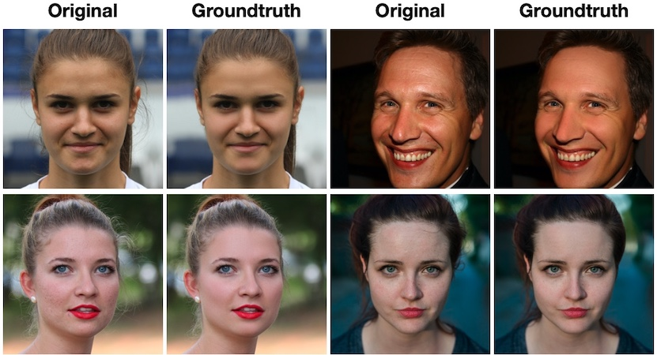

# Flickr-Faces-HQ-Retouching (FFHQR) Dataset




- [Flickr-Faces-HQ-Retouching (FFHQR) Dataset](#flickr-faces-hq-retouching-ffhqr-dataset)
  - [Licenses](#licenses)
  - [Overview](#overview)
  - [Acknowledgements](#acknowledgements)
  - [Privacy](#privacy)

Flickr-Faces-HQ-Retouching (FFHQR) is a high-quality image dataset of retouched human faces. The dataset is released as part of the following paper:

> **AutoRetouch: Automatic Professional Face Retouching**<br>
> Alireza Shafaei ([skylabtech](https://www.skylabtech.ai)), James J. Little (UBC), Mark Schmidt (UBC)<br>
> Winter Conference on Applications of Computer Vision (WACV), 2021<br>
> [See the Paper](https://openaccess.thecvf.com/content/WACV2021/html/Shafaei_AutoRetouch_Automatic_Professional_Face_Retouching_WACV_2021_paper.html)

The [original FFHQ dataset](https://github.com/NVlabs/ffhq-dataset) consists of 70,000 1 MP face-aligned images that are collected from Flickr. We professionally retouched FFHQ to create FFHQR. FFHQR is the first large-scale publicly available retouching dataset. We chose FFHQ as the basis of our new dataset because of the variety of ages, ethnicity, lighting conditions, and the large number of images that could benefit from face retouching.

For press, business, and other inquiries, please contact [alireza@skylabtech.ai](mailto:alireza@skylabtech.ai)

## Licenses

- The original FFHQ license is available [here](https://github.com/NVlabs/ffhq-dataset).
  - The individual images may have the following licenses: [Creative Commons BY 2.0](https://creativecommons.org/licenses/by/2.0/), [Public Domain Mark 1.0](https://creativecommons.org/publicdomain/mark/1.0/), [Creative Commons BY-NC 2.0](https://creativecommons.org/licenses/by-nc/2.0/), [Public Domain CC0 1.0](https://creativecommons.org/publicdomain/zero/1.0/), [U.S. Government Works](http://www.usa.gov/copyright.shtml).
  - According to the FFHQ homepage, "all of these licenses allow **free use, redistribution, and adaptation for non-commercial purposes**. However, some of them require giving **appropriate credit** to the original author, as well as **indicating any changes** that were made to the images."

The retouching dataset is made available under [Creative Commons BY-NC-SA 4.0](https://creativecommons.org/licenses/by-nc-sa/4.0/) license by [Skylab Technologies Incorporated](https://skylabtech.ai). You can **use, redistribute, and adapt it for non-commercial purposes**, as long as you (a) give appropriate credit by **citing our paper**, (b) **indicate any changes** that you've made, and (c) distribute any derivative works **under the same license**.

```bibtex
@InProceedings{Shafaei_2021_WACV,
    author    = {Shafaei, Alireza and Little, James J. and Schmidt, Mark},
    title     = {AutoRetouch: Automatic Professional Face Retouching},
    booktitle = {Proceedings of the IEEE/CVF Winter Conference on Applications of Computer Vision (WACV)},
    month     = {January},
    year      = {2021},
    pages     = {990-998}
}
```

## Overview

To use FFHQR, you first need to [download the original 1024x1024 FFHQ images](https://github.com/NVlabs/ffhq-dataset).

**The download links will be added soon.**

| Path | Size | Files | Format | Description
| :--- | :--: | ----: | :----: | :----------
| ffhqr-dataset |  |  | |
| &boxvr;&nbsp; [images1024x1024 - part 1]() |  GB | 10,000 | PNG (zipped) | 00000-09000
| &boxvr;&nbsp; [images1024x1024 - part 2]() |  GB | 10,000 | PNG (zipped) | 10000-19000
| &boxvr;&nbsp; [images1024x1024 - part 3]() |  GB | 10,000 | PNG (zipped) | 20000-29000
| &boxvr;&nbsp; [images1024x1024 - part 4]() |  GB | 10,000 | PNG (zipped) | 30000-39000
| &boxvr;&nbsp; [images1024x1024 - part 5]() |  GB | 10,000 | PNG (zipped) | 40000-49000
| &boxvr;&nbsp; [images1024x1024 - part 6]() |  GB | 10,000 | PNG (zipped) | 50000-59000
| &boxvr;&nbsp; [images1024x1024 - part 7]() |  GB | 10,000 | PNG (zipped) | 60000-69000
| &boxur;&nbsp; [thumbnails128x128]() | GB | 70,000 | PNG (zipped) | Thumbnails at 128&times;128

## Acknowledgements

We would like to thank the [PhotoRetouchOnline.com](http://PhotoRetouchOnline.com) team and the [Artona Group Inc.](https://www.artona.com/) staff for their valuable feedback and support. We thank Tero Karras (NVIDIA), Samuli Laine (NVIDIA), Timo Aila (NVIDIA) for the original FFHQ dataset.

## Privacy

If you wish to remove a photo that you own from FFHQ and FFHQR, please follow the [FFHQ instructions](https://github.com/NVlabs/ffhq-dataset#privacy) and make sure to include `alireza@skylabtech.ai` in the correspondences.
